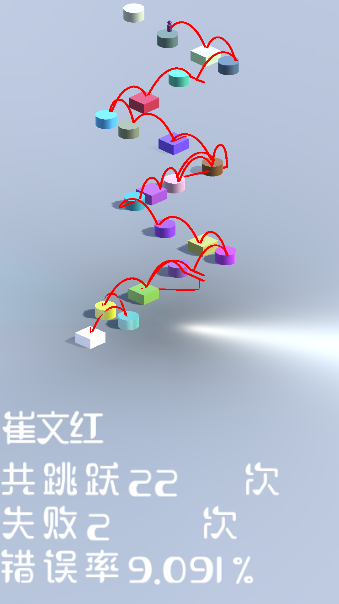

# JumpJump
一个基于unity的跳一跳游戏，为心理学专业同学的毕业设计做的外包。 
要求是记录玩家整个游戏的流程各种数据并上传到php服务器，其中砖块的大小会变化，有些砖块会来回的移动。 
安卓系统可以下载apk/JumpJump.apk体验 
 
A simple game build by Unity 
Press your screen for a long time, the longer you press the screen, the farther the character jump. 
Jump to more box to get a higher score! 
User's path and score can be recorded by the PHP server. 
If you are using Android, you can download apk/JumpJump.apk to play it. 

